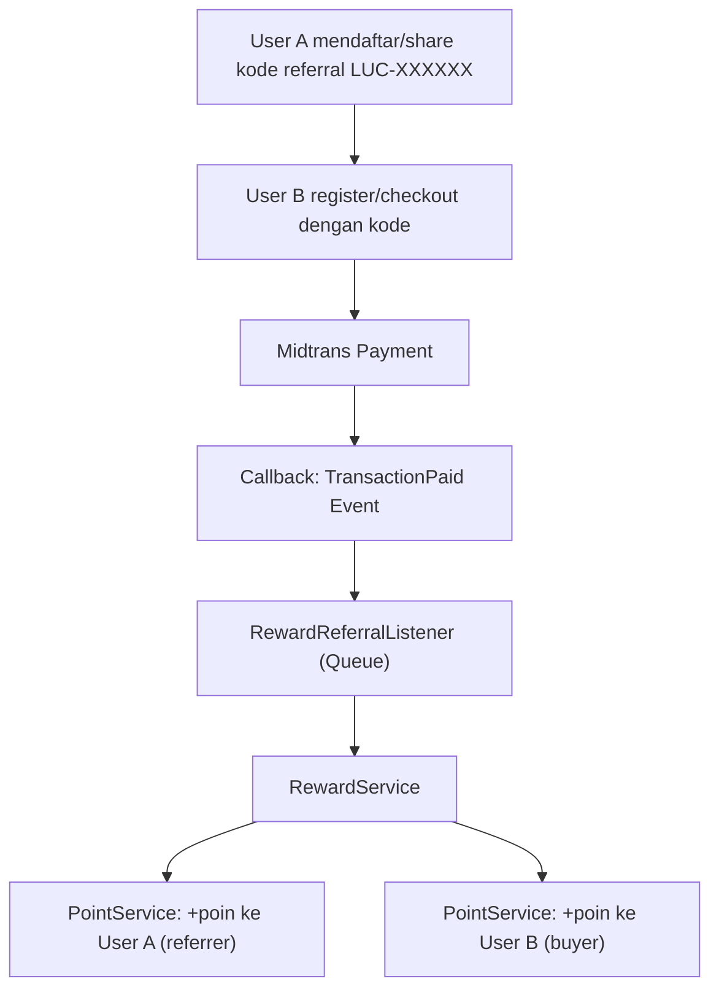

# Panduan Implementasi Fitur Referral & Point System

> Panduan ini diturunkan dari implementasi yang sudah berjalan di **sekolah-pajak**, disesuaikan untuk **levelupcounting**.
> Kedua project menggunakan stack: **Laravel + Inertia + React (TSX) + Midtrans + Spatie Roles**.

---

## Arsitektur Fitur



### Komponen yang Akan Dibuat

| No | Komponen | Tipe | Path |
|----|----------|------|------|
| 1 | Migration: referral columns on users | Migration | `database/migrations/` |
| 2 | Migration: point_transactions table | Migration | `database/migrations/` |
| 3 | Migration: settings table | Migration | `database/migrations/` |
| 4 | Migration: points_redeemed on invoices | Migration | `database/migrations/` |
| 5 | Model: Setting | Model | `app/Models/Setting.php` |
| 6 | Model: PointTransaction | Model | `app/Models/PointTransaction.php` |
| 7 | Model: User (modify) | Model | `app/Models/User.php` |
| 8 | Service: ReferralService | Service | `app/Services/ReferralService.php` |
| 9 | Service: PointService | Service | `app/Services/PointService.php` |
| 10 | Service: RewardService | Service | `app/Services/RewardService.php` |
| 11 | Event: TransactionPaid | Event | `app/Events/TransactionPaid.php` |
| 12 | Listener: RewardReferralListener | Listener | `app/Listeners/RewardReferralListener.php` |
| 13 | Controller: ReferralController (API) | Controller | `app/Http/Controllers/ReferralController.php` |
| 14 | Controller: ReferralAdminController | Controller | `app/Http/Controllers/Admin/ReferralAdminController.php` |
| 15 | Modify: RegisteredUserController | Controller | `app/Http/Controllers/Auth/RegisteredUserController.php` |
| 16 | Modify: SocialiteController | Controller | `app/Http/Controllers/Auth/SocialiteController.php` |
| 17 | Modify: InvoiceController | Controller | `app/Http/Controllers/InvoiceController.php` |
| 18 | Modify: MidtransCallbackController | Controller | `app/Http/Controllers/MidtransCallbackController.php` |
| 19 | Modify: ProfileController | Controller | `app/Http/Controllers/User/Profile/ProfileController.php` |
| 20 | Modify: AppServiceProvider | Provider | `app/Providers/AppServiceProvider.php` |
| 21 | Routes | Routes | `routes/web.php` |
| 22 | Frontend: admin referral pages | React/TSX | `resources/js/pages/admin/referral/` |
| 23 | Frontend: user referral page | React/TSX | `resources/js/pages/user/profile/referral.tsx` |

---

## Langkah 1: Database Migrations

### 1a. Tambah kolom referral pada tabel users

File: `database/migrations/YYYY_MM_DD_000001_add_referral_columns_to_users_table.php`

```php
<?php

use Illuminate\Database\Migrations\Migration;
use Illuminate\Database\Schema\Blueprint;
use Illuminate\Support\Facades\Schema;

return new class extends Migration
{
    public function up(): void
    {
        Schema::table('users', function (Blueprint $table) {
            $table->string('referral_code')->nullable()->unique()->after('id');
            $table->bigInteger('point_balance')->default(0)->after('referral_code');
        });
    }

    public function down(): void
    {
        Schema::table('users', function (Blueprint $table) {
            $table->dropColumn(['referral_code', 'point_balance']);
        });
    }
};
```

### 1b. Tabel point_transactions

File: `database/migrations/YYYY_MM_DD_000002_create_point_transactions_table.php`

```php
<?php

use Illuminate\Database\Migrations\Migration;
use Illuminate\Database\Schema\Blueprint;
use Illuminate\Support\Facades\Schema;

return new class extends Migration
{
    public function up(): void
    {
        Schema::create('point_transactions', function (Blueprint $table) {
            $table->uuid('id')->primary();
            $table->foreignUuid('user_id')->constrained('users')->onDelete('cascade');
            $table->string('type');           // reward, redeem, adjustment
            $table->string('source');         // referral, checkout, admin
            $table->bigInteger('amount');     // positif (tambah) atau negatif (kurang)
            $table->text('description');
            $table->string('reference_type')->nullable();
            $table->string('reference_id')->nullable();
            $table->timestamps();

            $table->index(['user_id', 'type']);
            $table->index(['reference_type', 'reference_id']);
        });
    }

    public function down(): void
    {
        Schema::dropIfExists('point_transactions');
    }
};
```

### 1c. Tabel settings (konfigurasi referral)

File: `database/migrations/YYYY_MM_DD_000003_create_settings_table.php`

```php
<?php

use Illuminate\Database\Migrations\Migration;
use Illuminate\Database\Schema\Blueprint;
use Illuminate\Support\Facades\DB;
use Illuminate\Support\Facades\Schema;

return new class extends Migration
{
    public function up(): void
    {
        Schema::create('settings', function (Blueprint $table) {
            $table->string('key')->primary();
            $table->text('value')->nullable();
            $table->timestamps();
        });

        DB::table('settings')->insert([
            ['key' => 'referral_reward',              'value' => '5000', 'created_at' => now(), 'updated_at' => now()],
            ['key' => 'buyer_reward',                 'value' => '2000', 'created_at' => now(), 'updated_at' => now()],
            ['key' => 'referral_only_first_purchase', 'value' => 'true', 'created_at' => now(), 'updated_at' => now()],
        ]);
    }

    public function down(): void
    {
        Schema::dropIfExists('settings');
    }
};
```

### 1d. Tambah kolom points_redeemed pada tabel invoices

File: `database/migrations/YYYY_MM_DD_000004_add_points_redeemed_to_invoices_table.php`

```php
<?php

use Illuminate\Database\Migrations\Migration;
use Illuminate\Database\Schema\Blueprint;
use Illuminate\Support\Facades\Schema;

return new class extends Migration
{
    public function up(): void
    {
        Schema::table('invoices', function (Blueprint $table) {
            $table->unsignedInteger('points_redeemed')->default(0)->after('transaction_fee');
        });
    }

    public function down(): void
    {
        Schema::table('invoices', function (Blueprint $table) {
            $table->dropColumn('points_redeemed');
        });
    }
};
```

> [!IMPORTANT]
> Jalankan `php artisan migrate` setelah membuat semua migration di atas.

---

## Langkah 2: Models

### 2a. Model Setting

File: `app/Models/Setting.php`

```php
<?php

namespace App\Models;

use Illuminate\Database\Eloquent\Model;

class Setting extends Model
{
    protected $primaryKey = 'key';
    public $incrementing  = false;
    protected $keyType    = 'string';
    protected $fillable   = ['key', 'value'];

    public static function get(string $key, $default = null)
    {
        $setting = self::find($key);
        if (!$setting) return $default;

        $value = $setting->value;
        if ($value === 'true')  return true;
        if ($value === 'false') return false;
        if (is_numeric($value)) {
            return strpos($value, '.') !== false ? (float)$value : (int)$value;
        }
        return $value;
    }

    public static function set(string $key, $value)
    {
        if (is_bool($value)) $value = $value ? 'true' : 'false';
        return self::updateOrCreate(['key' => $key], ['value' => (string)$value]);
    }
}
```

### 2b. Model PointTransaction

File: `app/Models/PointTransaction.php`

```php
<?php

namespace App\Models;

use Illuminate\Database\Eloquent\Concerns\HasUuids;
use Illuminate\Database\Eloquent\Model;

class PointTransaction extends Model
{
    use HasUuids;

    protected $guarded = ['created_at', 'updated_at'];

    public function user()
    {
        return $this->belongsTo(User::class);
    }

    public function reference()
    {
        return $this->morphTo();
    }
}
```

### 2c. Modifikasi Model User

Tambahkan ke `$fillable`:

```php
'referral_code',
'point_balance',
```

Tambahkan method `booted()` untuk auto-generate referral code:

```php
/**
 * Auto-generate referral code LUC-XXXXXX saat user baru dibuat.
 */
protected static function booted()
{
    static::creating(function ($user) {
        if (empty($user->referral_code)) {
            do {
                $code = 'LUC-' . strtoupper(\Illuminate\Support\Str::random(6));
            } while (static::where('referral_code', $code)->exists());
            $user->referral_code = $code;
        }
    });
}
```

Tambahkan relasi:

```php
public function referredInvoices()
{
    return $this->hasMany(Invoice::class, 'referred_by_user_id');
}

public function pointTransactions()
{
    return $this->hasMany(PointTransaction::class);
}
```

---

## Langkah 3: Services

### 3a. ReferralService

File: `app/Services/ReferralService.php`

Validasi kode referral saat checkout/registrasi. Mendukung lookup di **kedua kolom** (`referral_code` dan `affiliate_code`).

```php
<?php

namespace App\Services;

use App\Models\User;
use App\Models\Invoice;
use App\Models\Setting;

class ReferralService
{
    public function validateReferralCode(string $code, ?string $email = null, ?User $user = null): array
    {
        $code = strtoupper(trim($code));

        if (empty($code)) {
            return ['valid' => false, 'message' => 'Kode referral tidak boleh kosong.', 'referrer' => null];
        }

        $referrer = User::where('referral_code', $code)
            ->orWhere('affiliate_code', $code)
            ->first();

        if (!$referrer) {
            return ['valid' => false, 'message' => 'Kode referral tidak ditemukan.', 'referrer' => null];
        }

        if (!$user && !empty($email)) {
            $user = User::where('email', $email)->first();
        }

        if ($user) {
            if ($referrer->id === $user->id) {
                return ['valid' => false, 'message' => 'Anda tidak bisa menggunakan kode referral Anda sendiri.', 'referrer' => null];
            }

            if (Setting::get('referral_only_first_purchase', true)) {
                $hasPaidInvoice = Invoice::where('user_id', $user->id)->where('status', 'paid')->exists();
                if ($hasPaidInvoice) {
                    return ['valid' => false, 'message' => 'Referral hanya berlaku untuk pembelian pertama Anda.', 'referrer' => null];
                }
            }
        } else {
            if ($email && strtolower(trim($email)) === strtolower($referrer->email)) {
                return ['valid' => false, 'message' => 'Anda tidak bisa menggunakan kode referral Anda sendiri.', 'referrer' => null];
            }
        }

        return ['valid' => true, 'message' => 'Kode referral valid.', 'referrer' => $referrer];
    }
}
```

### 3b. PointService

File: `app/Services/PointService.php`

Mengelola transaksi poin (tambah, kurang, redeem, refund).

```php
<?php

namespace App\Services;

use App\Models\User;
use App\Models\Invoice;
use App\Models\PointTransaction;
use Illuminate\Support\Facades\DB;

class PointService
{
    public function addTransaction(
        User $user,
        int $amount,
        string $type,
        string $source,
        string $description,
        ?string $referenceType = null,
        ?string $referenceId = null
    ): PointTransaction {
        return DB::transaction(function () use ($user, $amount, $type, $source, $description, $referenceType, $referenceId) {
            $lockedUser = User::where('id', $user->id)->lockForUpdate()->first();
            if (!$lockedUser) throw new \Exception('User tidak ditemukan saat memproses transaksi poin.');

            $newBalance = $lockedUser->point_balance + $amount;
            if ($newBalance < 0) throw new \Exception('Saldo poin tidak mencukupi.');

            $lockedUser->update(['point_balance' => $newBalance]);
            $user->point_balance = $newBalance;

            return PointTransaction::create([
                'user_id'        => $lockedUser->id,
                'type'           => $type,
                'source'         => $source,
                'amount'         => $amount,
                'description'    => $description,
                'reference_type' => $referenceType,
                'reference_id'   => $referenceId,
            ]);
        });
    }

    public function redeemPoints(User $user, int $amount, Invoice $invoice): PointTransaction
    {
        return $this->addTransaction(
            $user, -$amount, 'redeem', 'checkout',
            "Penggunaan poin sebagai potongan harga invoice {$invoice->invoice_code}",
            Invoice::class, $invoice->id
        );
    }

    public function refundPoints(Invoice $invoice): ?PointTransaction
    {
        return DB::transaction(function () use ($invoice) {
            $deduction = PointTransaction::where('user_id', $invoice->user_id)
                ->where('reference_type', Invoice::class)->where('reference_id', $invoice->id)
                ->where('type', 'redeem')->where('amount', '<', 0)->first();

            if (!$deduction) return null;
            $refundAmount = abs($deduction->amount);

            $alreadyRefunded = PointTransaction::where('user_id', $invoice->user_id)
                ->where('reference_type', Invoice::class)->where('reference_id', $invoice->id)
                ->where('type', 'adjustment')->where('amount', '>', 0)
                ->where('description', 'like', '%Pengembalian poin%')->exists();

            if ($alreadyRefunded) return null;

            $user = User::find($invoice->user_id);
            if (!$user) return null;

            return $this->addTransaction(
                $user, $refundAmount, 'adjustment', 'checkout',
                "Pengembalian poin karena pembatalan/kadaluarsa invoice {$invoice->invoice_code}",
                Invoice::class, $invoice->id
            );
        });
    }

    public function adjustPoints($userId, int $amount, string $source, string $description): PointTransaction
    {
        $user = User::findOrFail($userId);
        return $this->addTransaction($user, $amount, 'adjustment', $source, $description);
    }
}
```

### 3c. RewardService

File: `app/Services/RewardService.php`

Dipanggil setelah pembayaran berhasil via listener. Memberikan poin ke referrer dan buyer.

```php
<?php

namespace App\Services;

use App\Models\User;
use App\Models\Invoice;
use App\Models\Setting;
use App\Models\PointTransaction;
use Illuminate\Support\Facades\DB;
use Illuminate\Support\Facades\Log;

class RewardService
{
    protected $pointService;

    public function __construct(PointService $pointService)
    {
        $this->pointService = $pointService;
    }

    /**
     * Proses reward referral setelah pembayaran berhasil.
     * Kolom referral di invoice: 'referred_by_user_id'.
     */
    public function processReferralReward(Invoice $invoice): void
    {
        Log::info('processReferralReward started', [
            'invoice_code'        => $invoice->invoice_code,
            'status'              => $invoice->status,
            'referred_by_user_id' => $invoice->referred_by_user_id,
        ]);

        DB::transaction(function () use ($invoice) {
            if ($invoice->status !== 'paid') {
                Log::warning('processReferralReward skipped: not paid', ['invoice_code' => $invoice->invoice_code]);
                return;
            }

            if (!$invoice->referred_by_user_id) {
                Log::warning('processReferralReward skipped: no referred_by_user_id', ['invoice_code' => $invoice->invoice_code]);
                return;
            }

            $rewardExists = PointTransaction::where('reference_type', Invoice::class)
                ->where('reference_id', $invoice->id)->where('source', 'referral')->exists();

            if ($rewardExists) {
                Log::info('Referral reward already processed', ['invoice_code' => $invoice->invoice_code]);
                return;
            }

            $buyer    = User::find($invoice->user_id);
            $referrer = User::find($invoice->referred_by_user_id);

            if (!$buyer || !$referrer) {
                Log::error('processReferralReward: buyer or referrer not found');
                return;
            }

            $onlyFirstPurchase = Setting::get('referral_only_first_purchase', true);
            if ($onlyFirstPurchase) {
                $paidInvoicesCount = Invoice::where('user_id', $buyer->id)->where('status', 'paid')->count();
                if ($paidInvoicesCount > 1) {
                    Log::info('Referral reward skipped: not first purchase', ['buyer_id' => $buyer->id]);
                    return;
                }
            }

            $referrerRewardAmount = (int) Setting::get('referral_reward', 5000);
            $buyerRewardAmount    = (int) Setting::get('buyer_reward', 2000);

            if ($referrerRewardAmount > 0) {
                $this->pointService->addTransaction(
                    $referrer, $referrerRewardAmount, 'reward', 'referral',
                    "Bonus referral dari pembelian pertama oleh {$buyer->name}",
                    Invoice::class, $invoice->id
                );
            }

            if ($buyerRewardAmount > 0) {
                $this->pointService->addTransaction(
                    $buyer, $buyerRewardAmount, 'reward', 'referral',
                    "Bonus pembelian menggunakan kode referral dari {$referrer->name}",
                    Invoice::class, $invoice->id
                );
            }

            Log::info('Referral reward processed successfully', [
                'invoice_code' => $invoice->invoice_code,
                'referrer'     => $referrer->name,
                'buyer'        => $buyer->name,
            ]);
        });
    }
}
```

---

## Langkah 4: Event & Listener

### 4a. Event: TransactionPaid

File: `app/Events/TransactionPaid.php`

```php
<?php

namespace App\Events;

use App\Models\Invoice;
use Illuminate\Foundation\Events\Dispatchable;
use Illuminate\Queue\SerializesModels;

class TransactionPaid
{
    use Dispatchable, SerializesModels;

    public $invoice;

    public function __construct(Invoice $invoice)
    {
        $this->invoice = $invoice;
    }
}
```

### 4b. Listener: RewardReferralListener

File: `app/Listeners/RewardReferralListener.php`

```php
<?php

namespace App\Listeners;

use App\Events\TransactionPaid;
use App\Services\RewardService;
use Illuminate\Contracts\Queue\ShouldQueue;
use Illuminate\Queue\InteractsWithQueue;
use Illuminate\Support\Facades\Log;

class RewardReferralListener implements ShouldQueue
{
    use InteractsWithQueue;

    protected $rewardService;

    public function __construct(RewardService $rewardService)
    {
        $this->rewardService = $rewardService;
    }

    public function handle(TransactionPaid $event): void
    {
        Log::info('RewardReferralListener triggered', [
            'invoice_code'        => $event->invoice->invoice_code,
            'referred_by_user_id' => $event->invoice->referred_by_user_id,
        ]);

        try {
            $this->rewardService->processReferralReward($event->invoice);
        } catch (\Exception $e) {
            Log::error('Gagal memproses reward referral', [
                'invoice_code' => $event->invoice->invoice_code,
                'error'        => $e->getMessage(),
            ]);
            throw $e;
        }
    }
}
```

> [!IMPORTANT]
> Listener ini menggunakan `ShouldQueue`. Pastikan `php artisan queue:listen` berjalan agar listener bisa diproses.

---

## Langkah 5: Registrasi Event di AppServiceProvider

File: `app/Providers/AppServiceProvider.php`

Tambahkan di method `boot()`:

```php
// Daftarkan event listener reward referral
\Illuminate\Support\Facades\Event::listen(
    \App\Events\TransactionPaid::class,
    \App\Listeners\RewardReferralListener::class
);
```

---

## Langkah 6: Controllers

### 6a. ReferralController (API validasi + get points)

File: `app/Http/Controllers/ReferralController.php`

```php
<?php

namespace App\Http\Controllers;

use App\Services\ReferralService;
use Illuminate\Http\Request;
use Illuminate\Support\Facades\Auth;

class ReferralController extends Controller
{
    protected $referralService;

    public function __construct(ReferralService $referralService)
    {
        $this->referralService = $referralService;
    }

    public function validateCode(Request $request)
    {
        $request->validate([
            'code'  => 'required|string',
            'email' => 'nullable|email',
        ]);

        $user  = Auth::user();
        $email = $request->input('email');

        if ($user && !$email) {
            $email = $user->email;
        }

        $result = $this->referralService->validateReferralCode($request->code, $email, $user);
        return response()->json($result);
    }

    public function getPoints(Request $request)
    {
        $user = Auth::user();
        if (!$user) {
            return response()->json(['point_balance' => 0], 401);
        }
        return response()->json(['point_balance' => (int) $user->point_balance]);
    }
}
```

### 6b. ReferralAdminController

File: `app/Http/Controllers/Admin/ReferralAdminController.php`

```php
<?php

namespace App\Http\Controllers\Admin;

use App\Http\Controllers\Controller;
use App\Models\User;
use App\Models\PointTransaction;
use App\Models\Setting;
use App\Services\PointService;
use Illuminate\Http\Request;
use Inertia\Inertia;

class ReferralAdminController extends Controller
{
    protected $pointService;

    public function __construct(PointService $pointService)
    {
        $this->pointService = $pointService;
    }

    public function settings()
    {
        return Inertia::render('admin/referral/settings', [
            'settings' => [
                'referral_reward'              => (int) Setting::get('referral_reward', 5000),
                'buyer_reward'                 => (int) Setting::get('buyer_reward', 2000),
                'referral_only_first_purchase' => (bool) Setting::get('referral_only_first_purchase', true),
            ],
        ]);
    }

    public function updateSettings(Request $request)
    {
        $request->validate([
            'referral_reward'              => 'required|integer|min:0',
            'buyer_reward'                 => 'required|integer|min:0',
            'referral_only_first_purchase' => 'required|boolean',
        ]);

        Setting::set('referral_reward', $request->referral_reward);
        Setting::set('buyer_reward', $request->buyer_reward);
        Setting::set('referral_only_first_purchase', $request->referral_only_first_purchase);

        return redirect()->back()->with('success', 'Pengaturan referral berhasil diperbarui.');
    }

    public function report()
    {
        $referrers = User::whereHas('referredInvoices', function ($query) {
                $query->where('status', 'paid');
            })
            ->withCount(['referredInvoices as referrals_count' => function ($query) {
                $query->where('status', 'paid');
            }])
            ->orderBy('referrals_count', 'desc')
            ->paginate(15);

        return Inertia::render('admin/referral/report', ['referrers' => $referrers]);
    }

    public function transactions(Request $request)
    {
        $query = PointTransaction::with('user');

        if ($request->has('search')) {
            $search = $request->search;
            $query->whereHas('user', function ($q) use ($search) {
                $q->where('name', 'like', "%{$search}%")->orWhere('email', 'like', "%{$search}%");
            });
        }

        $transactions = $query->orderBy('created_at', 'desc')->paginate(15);
        $users = User::select('id', 'name', 'email', 'point_balance')->orderBy('name')->limit(200)->get();

        return Inertia::render('admin/referral/transactions', [
            'transactions' => $transactions,
            'users'        => $users,
            'filters'      => $request->only(['search']),
        ]);
    }

    public function adjustPoints(Request $request)
    {
        $request->validate([
            'user_id'     => 'required|string',
            'amount'      => 'required|integer',
            'description' => 'required|string|max:255',
        ]);

        try {
            $user = User::where('id', $request->user_id)
                ->orWhere('name', $request->user_id)
                ->orWhere('email', $request->user_id)
                ->first();

            if (!$user) {
                return redirect()->back()->withErrors(['user_id' => 'Pengguna tidak ditemukan.']);
            }

            if ($request->amount < 0 && $user->point_balance < abs($request->amount)) {
                return redirect()->back()->withErrors(['amount' => 'Saldo poin tidak mencukupi.']);
            }

            $this->pointService->adjustPoints($user->id, $request->amount, 'manual_adjustment', $request->description);
            return redirect()->back()->with('success', 'Saldo poin berhasil disesuaikan secara manual.');
        } catch (\Exception $e) {
            return redirect()->back()->withErrors(['error' => 'Gagal menyesuaikan poin: ' . $e->getMessage()]);
        }
    }
}
```

---

## Langkah 7: Modifikasi Controller yang Sudah Ada

### 7a. RegisteredUserController

Uncomment dan modifikasi validasi `affiliate_code` agar mendukung **kedua kolom** (`affiliate_code` dan `referral_code`):

```php
$request->validate([
    // ... existing rules ...
    'affiliate_code' => [
        'nullable',
        'string',
        function ($attribute, $value, $fail) {
            $exists = User::where('affiliate_code', $value)
                ->orWhere('referral_code', $value)
                ->exists();
            if (!$exists) {
                $fail('The selected affiliate code is invalid.');
            }
        }
    ],
]);

$affiliateCode = $request->affiliate_code
    ?? session('referral_code')
    ?? 'LUC2025'; // default affiliate code sekolah-pajak

$referred_by_user_id = null;
if ($affiliateCode) {
    $affiliateUser = User::where('affiliate_code', $affiliateCode)
        ->orWhere('referral_code', $affiliateCode)
        ->first();
    if ($affiliateUser) {
        $referred_by_user_id = $affiliateUser->id;
    }
}
```

### 7b. SocialiteController

Update referrer lookup:

```php
$referralCode = session('referral_code', 'LUC2025');
$referrer = User::where('affiliate_code', $referralCode)
    ->orWhere('referral_code', $referralCode)
    ->first();

if (!$referrer) {
    $referrer = User::where('affiliate_code', 'LUC2025')->first();
}
```

### 7c. InvoiceController — Referral Code Lookup saat Checkout

Di semua tempat yang melakukan lookup referral code, ubah query menjadi:

```php
$referrer = User::where('affiliate_code', $referralCode)
    ->orWhere('referral_code', $referralCode)
    ->first();
```

### 7d. MidtransCallbackController — Dispatch TransactionPaid Event

Di method `processPaymentSuccess()` (atau equivalent), tambahkan setelah proses enrollment dan affiliate commission:

```php
// Dispatch event untuk reward referral
event(new \App\Events\TransactionPaid($invoice));
```

### 7e. ProfileController — Halaman Referral User

Tambahkan method `referral()`:

```php
public function referral()
{
    $user   = Auth::user();
    $userId = $user->id;

    $transactions = \App\Models\PointTransaction::where('user_id', $userId)
        ->orderBy('created_at', 'desc')
        ->get();

    $totalReferralsCount = \App\Models\Invoice::where('referred_by_user_id', $userId)
        ->where('status', 'paid')
        ->count();

    $totalPointsEarned = \App\Models\PointTransaction::where('user_id', $userId)
        ->where('amount', '>', 0)
        ->sum('amount');

    return Inertia::render('user/profile/referral', [
        'referralCode'   => $user->referral_code,
        'pointBalance'   => (int) $user->point_balance,
        'totalReferrals' => $totalReferralsCount,
        'totalEarned'    => (int) $totalPointsEarned,
        'transactions'   => $transactions,
    ]);
}
```

---

## Langkah 8: Routes

Tambahkan di `routes/web.php`:

```php
// === API Routes (tanpa auth) ===
Route::post('/api/referral/validate', [App\Http\Controllers\ReferralController::class, 'validateCode'])
    ->name('api.referral.validate');

// === Authenticated User Routes ===
Route::middleware(['auth', 'verified'])->group(function () {
    // User points API
    Route::get('/api/user/points', [App\Http\Controllers\ReferralController::class, 'getPoints'])
        ->name('api.user.points');

    // User profile referral page
    Route::get('/profile/referral', [ProfileController::class, 'referral'])
        ->name('profile.referral');
});

// === Admin Routes ===
Route::middleware(['auth', 'verified', 'role:admin'])->prefix('admin')->group(function () {
    // Referral settings
    Route::get('referral/settings', [App\Http\Controllers\Admin\ReferralAdminController::class, 'settings'])
        ->name('admin.referral.settings');
    Route::post('referral/settings', [App\Http\Controllers\Admin\ReferralAdminController::class, 'updateSettings'])
        ->name('admin.referral.settings.update');

    // Referral report
    Route::get('referral/report', [App\Http\Controllers\Admin\ReferralAdminController::class, 'report'])
        ->name('admin.referral.report');

    // Point transactions
    Route::get('referral/transactions', [App\Http\Controllers\Admin\ReferralAdminController::class, 'transactions'])
        ->name('admin.referral.transactions');
    Route::post('referral/adjust-points', [App\Http\Controllers\Admin\ReferralAdminController::class, 'adjustPoints'])
        ->name('admin.referral.adjust-points');
});
```

---

## Langkah 9: Frontend Pages

> [!NOTE]
> Halaman frontend (React/TSX) untuk admin referral settings, report, transactions, dan user profile referral page harus dicopy dari **talenta-edu** di:
> - `resources/js/pages/admin/referral/` (6 file)
> - `resources/js/pages/user/profile/referral.tsx`
>
> Sesuaikan import path, layout, dan branding sekolah-pajak.

---

## Langkah 10: Sidebar Navigation

Tambahkan menu referral di sidebar admin dan user profile layout:

**Admin sidebar:**
- Pengaturan Referral → `route('admin.referral.settings')`
- Laporan Referral → `route('admin.referral.report')`
- Transaksi Poin → `route('admin.referral.transactions')`

**User profile sidebar/menu:**
- Referral → `route('profile.referral')`

---

## Perbedaan Kunci antara Talenta-Edu dan Sekolah-Pajak

| Aspek | Talenta-Edu | Sekolah-Pajak |
|-------|-------------|---------------|
| Referral code format | `TALE-XXXXXX` | `LUC-XXXXXX` |
| Default affiliate code | `TAL2025` | `LUC2025` |
| Invoice prefix | `SPK-` | `SPK-` (masih sama) |
| Branding | Sekolah Pajak | Level Up Accounting |

> [!WARNING]
> Sekolah-pajak tidak memiliki kolom `city` pada tabel `users`. Pastikan untuk **tidak** menginclude validasi/field `city` saat mengimplementasi form registrasi dan checkout.

---

## Checklist Implementasi

- [ ] Buat 4 migration files
- [ ] Jalankan `php artisan migrate`
- [ ] Buat model `Setting` dan `PointTransaction`
- [ ] Modifikasi model `User` (fillable, booted, relasi)
- [ ] Buat `ReferralService`, `PointService`, `RewardService`
- [ ] Buat `TransactionPaid` event
- [ ] Buat `RewardReferralListener`
- [ ] Daftarkan event listener di `AppServiceProvider`
- [ ] Buat `ReferralController`
- [ ] Buat `ReferralAdminController`
- [ ] Modifikasi `RegisteredUserController`
- [ ] Modifikasi `SocialiteController`
- [ ] Modifikasi `InvoiceController` (referral lookup)
- [ ] Modifikasi `MidtransCallbackController` (dispatch event)
- [ ] Tambahkan method `referral()` di `ProfileController`
- [ ] Tambahkan routes di `web.php`
- [ ] Copy dan adaptasi frontend pages
- [ ] Tambahkan navigasi sidebar
- [ ] Test: registrasi dengan kode referral
- [ ] Test: checkout dengan kode referral
- [ ] Test: reward poin diberikan setelah pembayaran
- [ ] Test: admin settings & point adjustment
- [ ] Pastikan `php artisan queue:listen` berjalan


---

## Langkah 11: Generate Referral Code untuk User Lama

Setelah migration berjalan, user-user lama tidak memiliki `referral_code`. Buat command:

```bash
php artisan make:command GenerateReferralCodes
php artisan referral:generate-codes
```

Pastikan juga ada user dengan `affiliate_code = LUC2025` di database (default affiliate/owner).
